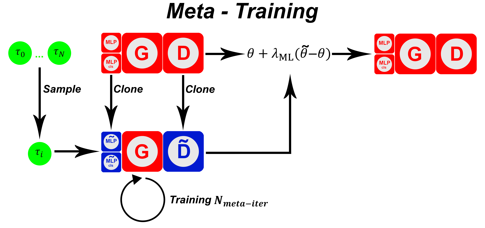

# GAN and Meta Learning
In this work, have been proposed different GAN architectures whose goal is the generalization of the weights acquired during training. In particular, was used a training paradigm based on meta-learning. 
The ability to adapt previous knowledge to new situations is a distinctive feature of human intelligence. It tends to solve a large number of problems with a reduced observation of the available examples. 
In contrast, artificial intelligence systems use an increasing amount of data to solve very specific problems.
Getting closer to the efficiency of human learning would turn this problem around.  
Meta-Learning is a subfield of Machine Learning, it is aimed at the search for new and more efficient learning paradigms. The aim is to try to compensate as much as possible for the enormous gap between humans and machines. Meta-Learning is one of the central topics of this work. Despite the existence of multiple algorithms, it was decided to use Reptile, an algorithm introduced by Nichol, Achiam and Schulman. 
Another central aspect of this work concerns the issue of generating new images using a technology called Generative Adversarial Networks (GAN). 
When we talk about GAN architecture we refer to two or more neural networks that interact with each other, the Discriminator and the Generator.  

## Hypothesis
The idea of this work is to combine Meta-Learning with a GAN, <b><i>with the peculiarity of maintaining the classic training paradigm for the Generator and applying Reptile to other models of architecture</i></b>. The aim is to make it possible to generate unseen domains, reconstructing the new data starting from the generalized weights during the training phase. Despite the exclusion of Reptile from the generator, all the benefits of the new paradigm will be preserved.  

------------------------------------
## The Thesis (italian):
### Chapter 1
Concerns the state of the art, some basic concepts will be introduced, with particular attention to neural networks, different GAN architectures and Meta-Learning. Algorithms such as MAML and Reptile will be described, highlighting their differences.  
### Chapter 2
eals with the description of the proposed system. The various hypotheses advanced during the writing of the work are presented. In particular, it describes the process that led to the application of Reptile to the GAN architecture, excluding the Generator from the latter. More approaches called 1MLP or 2MLP are proposed and subsequently, they will be compared. 
The result of Reptile's application to the proposed GAN is a self-conditioned architecture similar to a standard cDCGAN, which however retains the advantages of meta-learning and is much more flexible in learning new image domains. 
The basic architecture modified during the work is based on DCGAN and WGAN-gp, during the application of Reptile they have been modified in order to respect the assumptions. Depending on the approach, an MLP model or two MLP models were applied. The 1MLP approach performs the function of mapping the n domains of the dataset, creating for each of them a specific distribution for the task to be sent to the generator, while the 2MLP approach adds further diversity to the distributions created, to avoid overlapping problems domains. In this case the output of the initial MLP is concatenated with an intermediate output of the discriminator.  
### Chapter 3
Reports the experimental results from the metrics score obtained by training the system described with Meta-Learning. The scores will be compared to other standard architectures, such as cDCGAN. The metrics used to confirm the hypothesis of operation are: Frechet Inception Distance (FID) and Inception Score (IS).
More training was carried out on different datasets, in particular: MNIST, CIFAR10 and OMNIGLOT. On each of them the scores were evaluated using metrics about the quality of the generations.  

## Experimental data to support the hypothesis
The proposed architecture, in particular, the 2MLP approach returned qualitatively superior data compared to a classic cDCGAN, which is unable to generalize. This not only demonstrates the central hypothesis of this work, but also makes architecture a more flexible alternative to cDCGAN.
The propensity to imitate domains never seen before by 2MLP is highlighted, based on other weights acquired through other domains. 
The OMNIGLOT dataset, being very small, instead highlighted the ability to be able to imitate domains excluded from the training phase, starting from a few examples available. 
The result was possible thanks to the application of Meta-Learning. This alternative training paradigm has proved to be quite valid, and is particularly useful in situations where the available data is insufficient.
  

## Paper
<a id="1">[1]</a> 
Fontanini, T., Praticò, C., Prati, A. (2022). Towards Latent Space Optimization of GANs Using Meta-Learning. In: Sclaroff, S., Distante, C., Leo, M., Farinella, G.M., Tombari, F. (eds) Image Analysis and Processing – ICIAP 2022. ICIAP 2022. Lecture Notes in Computer Science, vol 13231. Springer, Cham. https://doi.org/10.1007/978-3-031-06427-2_54

------------------------------------

<i>This work took me a long time, I still remember my lonely Christmas in the city of Parma (IT) while I was training the various models and collecting data with my junk computers. I sincerely thank the people who have trusted me and left maximum freedom to express my ideas. It was my first experience of full participation in a research context and I will always carry it with me.</i>
